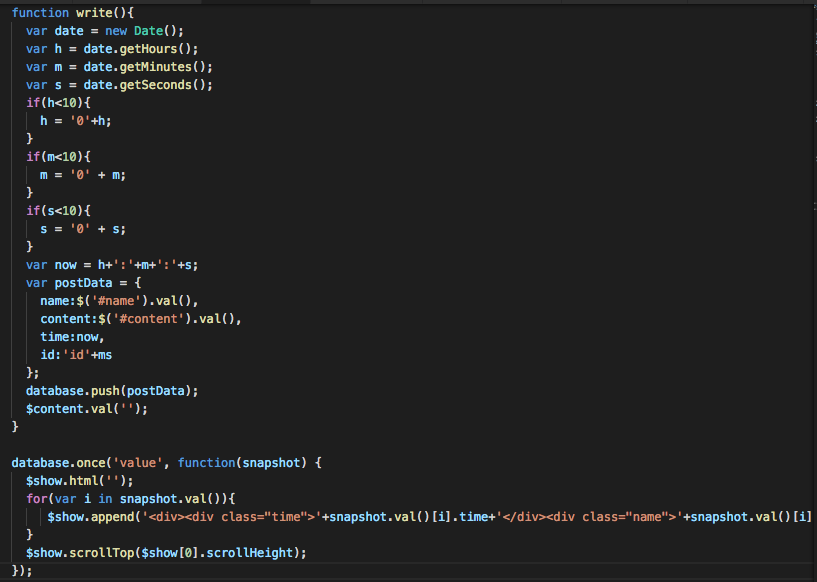
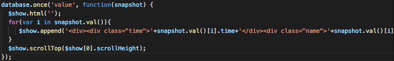
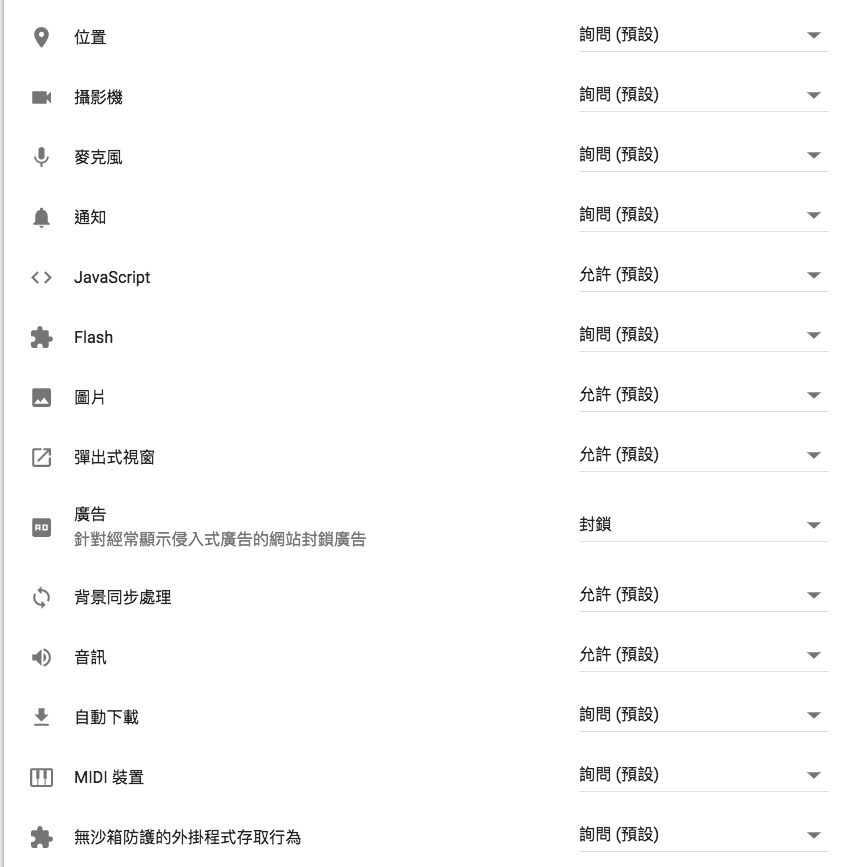
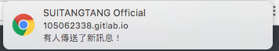
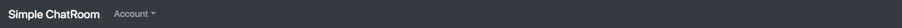
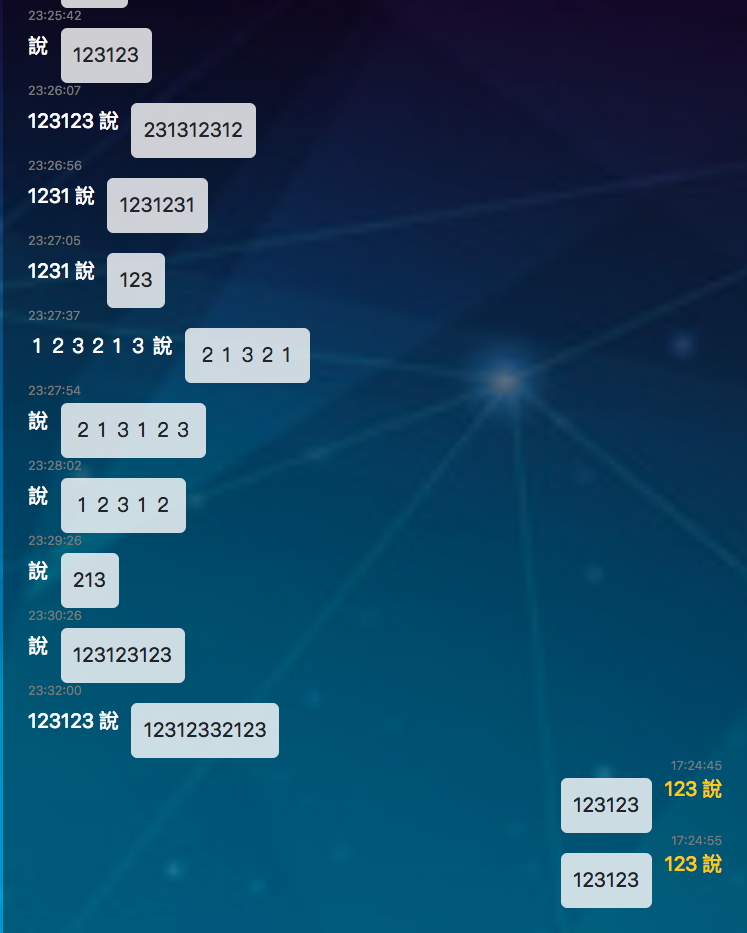
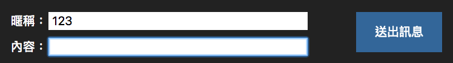
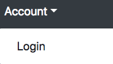
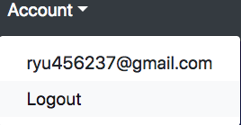

# Software Studio 2018 Spring Midterm Project
## Notice
* Replace all [xxxx] to your answer

## Topic
* [Chat_Room]
* Key functions (add/delete)
    1. [chat]
    </img>
    2. [load message history]
    </img>
    3. [chat with new user]
* Other functions (add/delete)
    1. [Sign Up/In with Google or other third-partyaccounts]
    </img>
    2. [Use CSS animation]
    </img>
    3. [Proove your website has strong security]
    </img>
    4.[Add Chrome notification]
    </img>

## Basic Components
|Component|Score|Y/N|
|:-:|:-:|:-:|
|Membership Mechanism|20%|N|
|GitLab Page|5%|N|
|Database|15%|N|
|RWD|15%|N|
|Topic Key Function|15%|N|

## Advanced Components
|Component|Score|Y/N|
|:-:|:-:|:-:|
|Third-Party Sign In|2.5%|N|
|Chrome Notification|5%|N|
|Use CSS Animation|2.5%|N|
|Security Report|5%|N|
|Other functions|1~10%|N|

## Website Detail Description
    主要分為兩個網頁，一個是聊天室的網頁，一個是login的網頁。
    
    在聊天室的網頁中大致上可以分為三個區塊，navbar,聊天內容區,暱稱和輸入內容區。
    ##
</img>
</img>
</img>
    
    navbar：有一個account可以往下拉，往下拉後若當前有使用者登入，則會顯示當前使用者的帳戶名稱，且在帳戶名稱下方會有一個logout的按鈕可以登出，反之，若是沒有在沒有使用者登入的情況下則會顯示login的按鈕，點擊即可跳往login的頁面。
    ##
</img>
</img>

    聊天內容區：在這個區域當中會顯示大家的聊天內容以及自己說的話。
    
    暱稱和輸入內容區：可以設定暱稱，決定顯示在聊天內容區時的名字。在內容的格子中，可以輸入想說的話。在暱稱與內容的格子旁則是送出訊息的按鈕，這個按鈕加了css animation，可以讓按鈕閃爍，提示使用者送出訊息，而為了增加方便性，也讓他在按下enter鍵時也可以送出訊息，不用再移動滑鼠按下按鈕。

    最後是login的網頁，在這個網頁中大部分都是把在lab課實作的內容套用過來的，並且新增了facebook登入的選項。
## Security Report (Optional)
    變更網站權限，使某些特定東西需要經過詢問才能使用。
